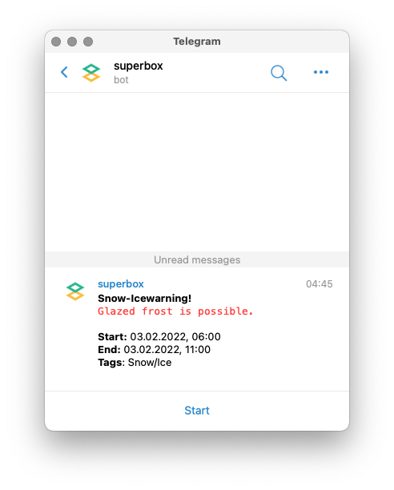

# OpenWeatherMap Telegram Alert

Send OpenWeatherMap alerts (One Call API) to telegram users.



## Installation

**Requirements:**

```shell
$ apt install python3-yaml python3-requests
```

Copy the `om-telegram-alert.py` file:

```shell
$ cp src/usr/local/sbin/om-telegram-alert.py /usr/local/sbin/om-telegram-alert.py
$ chmod +x /usr/local/sbin/om-telegram-alert.py
```

Copy the `om-telegram-alert.yaml` configuration file:

```shell
$ cp src/etc/default/om-telegram-alert.yaml /etc/default
```

## Configuration

You can set OpenWeatherMap and Telegram settings in the `/etc/default/om-telegram-alert.yaml`.

### OpenWeaterMap

| Key            | Value                                              |
|----------------|----------------------------------------------------|
| `lat`          | latitude - Geographical coordinates (required).    |
| `lon`          | longitude - Geographical coordinates (required).   |
| `appid`        | Your unique API key (required).                    |
| `exclude_tags` | A list of tags to exlclude from sending messages. |

### Telegram

| Key        | Value                     |
|------------|---------------------------|
| `token`    | Bot token (required).     |
| `chat_ids` | User chat ids (required). |

## Start systemd timer

The timer check every 15 minutes for new entries.

```shell
$ cp src/etc/systemd/system/om-telegram-alert.* /etc/systemd/system
$ systemctl enable --now om-telegram-alert.timer
```
